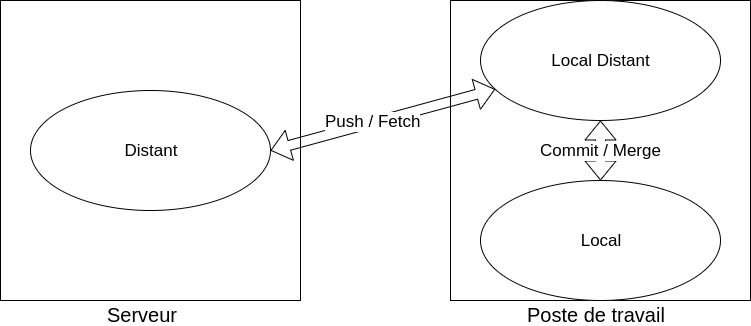
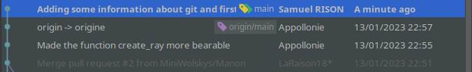
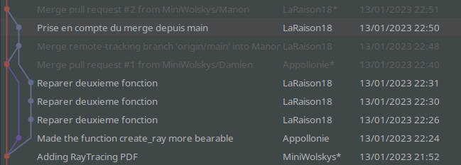
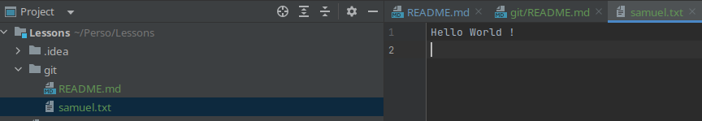

# GIT

Git est un outil de versionning et de developpement collaboratif et participatif.
Il permet a une ou plusieurs personnes.s de travailler sur un repertoire, de créer des copies et d'apporter des
modifications, de gérer différentes versions, et de partager son projet.  
Il a notamment été développée par Linus Torvald, à qui l'on doit également le système d'exploitation Linux.  
Vous trouverez ici toutes les ressources pour faire l'exercice, qui vous feras un point d'entrée facile aussi bien sur
le monde de git que sur ce projet / repertoire.

# Sommaire
1. [Fonctionnement](#Fonctionnement)
2. [Installation](#Installation)
3. [Utilisation](#Utilisation)
4. [Normes](#Normes)
5. [Exercice](#Exercice)
6. [Documentation](#Documentation)

## Fonctionnement

### Global

Ici, nous allons aborder le fonctionnement en surface de git. En effet, il est inutile de comprendre tous les mécanismes
de comparaisons pour une utilisation simple de Git. Si vous souhaitez rentrer davantage dans le détail, vous pourrez
trouver des liens dans la section [documentation](#Documentation).

Git fonctionne la majorité du temps avec un repository distant (ici, ce repository sur Github).
Dans ces cas-là, il fonctionne généralement sur un système de triple repository : Un distant et deux locaux.
Le repository distant est considéré comme le repository principal. C'est sur lui que l'on va se câbler, cloner, et
pusher nos modifications.  
Des deux repository - ou repertoire - locaux, vous en connaissez probablement un. Celui sur lequel vous apportez vos
modifications. Cependant, il en existe un second, que l'ont peut considérer comme cacher. C'est celui sur lequel vous
allez pouvoir commit vos modifications.

On nomme ces repertoires :
- Repertoire distant : Celui qui est généralement situé sur un serveur, considéré comme le repertoire principal.
- Repertoire local : Celui sur lequel vous effectuez vos modifications, vos tests... Votre terrain de jeu.
- Repertoire local distant : Repertoire sur votre machine, non accessible directement. Il fait le lien entre le
repertoire local et le repertoire distant. Vous le modifierais en faisant des commits ou d'autres manipulations.

Ainsi, au lancement de votre projet, vous allez cloner depuis le repertoire distant. Une fois cette action effectuer,
Git vas vous ajouter les deux repertoires locaux. Vous allez accomplir vos modifications sur votre repertoire local,
puis les commit vers votre repertoire caché, avant de les pushs vers votre repertoire local distant.

Le repertoire local est toujours sur la branche actuellement en cours d'utilisation. Les repertoires local distant et
distant contiennent la liste de toutes les branches qui leurs ont été passé (via un push ou un pull).

Ici, on peut voir que le repertoire local et le local distant communique en envoyant des push (du local distant vers le
distant) ou des fetchs (du distant vers le local distant), et que les repertoires local distant et local discute via des
commits (du local vers le local distant) et des merges (du local distant vers le local).  
L'action de pull les modifications fait en réalité un fetch puis un merge.

### Commits

Les modifications apportées a des fichiers sont appliqués sous la forme de "commit".
Lorsque vous faites des modifications a vos fichiers, ils ne sont modifiés que sur le repertoire local. Pour les
déplacer vers le repertoire local distant ou ils seront sauvegardé, il faudra spécifier quels fichiers vous souhaitez
envoyer, puis les "commit" afin de créer un objet de sauvegarde. C'est ensuite ce dernier qui seras envoyé vers le
serveur distant lors de votre push.

Un commit est identifiable par un ID, contient les informations du créateur dudit commit, la date et l'heure du commit,
ainsi que la liste des changements enregistrer sur ce commit.

### Branches

Les branches sont un système de developpement parallele sur Git. Elles permettent de developer une feature ou de
résoudre un bug sans modifier directement la branche principale.

Historiquement, la branche principale s'appelait master, mais depuis quelques années, on trouve plutôt la branche main.
Nous utiliserons donc la branche main comme branche principale, mais vous trouverez encore souvent d'anciens projets dont
la branche principale s'appelle master.

On peut créer une nouvelle branche afin de tester une modification, avant de la rapatrier sur la branche main une fois
les modifications validées. Cela permet également de garder une branche main propre en toute situation, puisque les
modifications doivent être testées et validé avant d'être rassemblés. Enfin, cela permet également à plusieurs personnes
de travailler en parrallele sur plusieurs branches, sans risquer de modifier le travail de l'un ou de l'autre.

### Authentification

Git gere un système d'authentification pour accéder aux repertoires privés, ainsi que pour s'identifier lors de
modifications. Ce système utilise SSH, un outil d'authentification par clé privée et public.  
On donne alors sa clé SSH publique a git, dans les paramètres de son compte, et on stocke sa clé privée sur le PC.
Ainsi, lorsque Git et votre machine souhaiteront discuter, ils s'identifieront d'abord avec les clés et pourront
ensuite être certains de l'identité de leur interlocuteur.  
Pour plus d'information, veuillez consultez la [documentation](#Documentation)

Un bon nombre d'IDE (Interface de Developpement) intègre les outils de gestion de version Git. Ici, nous verrons comment
utilisez les lignes de commandes, mais vous pourrez également faire avec les outils de votre IDE.

## Installation

### Git

Sur certaines machines, Git est préinstallé. Pour savoir si Git est installé, faites :  
`git --version`
dans un terminal

Si vous n'avez pas d'erreur a cette ligne et qu'une version est affichée, vous pouvez passez à
[l'installation de SSH](#SSH)

Sinon, il vous faudra d'abord l'installer :

- #### Windows :

Télécharger l'installateur [Git For Windows](https://gitforwindows.org/), puis executez le. Suivez les étapes
d'installation jusqu'au bout.

- #### OSX :

Télécharger et installer [Git For Mac](https://sourceforge.net/projects/git-osx-installer/).

- #### Linux :

Utiliser votre gestionnaire de packet pour installer git (apt-get, dnf...)  
`sudo apt-get update`  
`sudo apt-get install git`  

- #### Tous :

Une fois l'installation effectuée, dans le terminale de votre machine, tapez à nouveau la commande  
`git --version`  
et vérifiez que la commande vous renvoie bien une version.

### SSH

- #### Windows :

Pour se connecter a github sur Windows, on utilise les clés SSH. Pour en générer une, nous allons utiliser l'outil
[OpenSSH](https://www.openssh.com/). Par défaut, les PC Windows viennent avec une version de OpenSSH fournis par
Windows.  
Pour activer OpenSSH, il faut se rendre dans les `Parametres`, dans `Applications`, `Fonctionnalitées facultatives`.
Cherchez "Client OpenSSH". S'il n'est pas présent, cliquez sur `Ajouter une fonctionnalitée` puis installez
"Client SSH".

Une fois cela fait, ouvrez un terminal et entrez la commande `ssh-keygen`. Le système va vous demander ou enregistrer
vos clés SSH en vous proposant un repertoire par défaut. Notez-vous le repertoire par défaut et appuyer sur entrée,
puis encore une fois losqu'il vous demande une passphrase.

Généralement, votre repertoire par défaut seras `C:\Users\your_username\.ssh`.

- #### Linux / MacOs :

Les systems UNIX (Linux et MacOs) embarquent une version de SSH nativemment. Ainsi, vous aurez juste à ouvrir votre
terminal et à entrer la commande `ssh-keygen -t rsa`. Le système va vous demander ou enregistrer vos clés SSH en
vous proposant un repertoire par défaut. Notez-vous le repertoire par défaut et appuyer sur entrée, puis encore une
fois losqu'il vous demande une passphrase.

Généralement, votre repertoire par défaut seras `~/home/.ssh/`.

- #### Tous :

Dans votre répértoire par défaut, vous trouverez deux fichiers : id_rsa et id_rsa.pub. Le fichier id_rsa est votre
fichier de clé privée. Ne le partagez jamais avec quelqu'un d'autre. Le fichier id_rsa.pub est votre clé public, c'est
celle ci qu'il faudra fournir à Github et aux autres systeme qui s'authentifie par SSH.

Vous pouvez ouvrir votre fichier id_rsa.pub dans un editeur de texte basique pour obtenir le contenu du fichier, que
vous pourrez ensuite copier dans votre profil github, sous `Settings/SSH and GPG keys/New`. Ajouter en titre le nom de
votre PC, afin de pouvoir facilement reconnaitre quel clé correspond a quel PC.

## Utilisation

Commandes :
- Cloner un repository : `git clone <url>`
- Ajouter une modification : `git add <file>`
- Commit un changement : `git commit -m "Commit message"`
- Envoyer les modifications vers le repertoire distant : `git push`
- Recuperer les modifications depuis le retpertoire distant : `git pull`
- Changer de branche : `git checkout <branch_name>`
- Créer une nouvelle branche : `git checkout -b <branch_name>`
- Gérer les branches : `git branch <option> <branch>`

L'utilisation classique sera de cloner un repository, afin de pouvoir y accéder en local. Cela créera le repertoire
local et le repertoire local distant.  
Ensuite, on peut le lire librement et créer une branche pour y apporter une modification.
Pendant que l'on travaille, on peut sauvegarder un état en utilisant les commandes `add` et `commit`, faire des tests,
etc... On peut également pousser les modifications sur le serveur distant, qui créera la nouvelle branche afin de
séparer les changements.  
Une fois satisfait des changements apportés, on pourra ouvrir une pull request afin de demander une revue de notre code
et de nos changements. Une fois celle-ci validé, on peut la merge sur la branche main et supprimer notre branche
actuelle.  
Si l'on souhaite abandonner sa modification en cours de route, on peut simplement changer de branche, mais il est
préférable d'également supprimer la branche brouillonne, du repertoire local distant et du repertoire distant.

## Normes

Sur ce repository, la branche main ne seras jamais modifiable directement. Ainsi, chaque modification devra passer par
une branche et une pull request. Les branches doivent être nommées clairement et les pull request également. De plus, la
description d'une pull request doit permettre a n'importe qui de comprendre rapidement le sujet de cette dernière et
l'ampleur des modifications apportée.

Ces normes seront mise à jour régulierement, n'hésitez pas à y revenir de temps a autre et à proposer vos propres modifications.

## Exercice

Commençons par cloner le repository actuel. Il vous faudra pour cela un compte Github et suivis le protocole
d'installation définis [précédemment](#Installation).

Une fois tout installé, veuillez cloner le repertoire, en utilisant le bouton "clone" en haut de la page principale du
repertoire, et en sélectionnant l'option SSH. Vous pouvez faire ceci avec l'invite de commande Windows / Linux / Mac ou
depuis votre IDE directement.  
Vous pouvez alors vous déplacer dans le repertoire nouvellement cloné et exploré les différents projets actuellement en
cours, visiter les différents fichiers...

Afin de pouvoir apporter votre premiere modification, vous devrez donc créer une branche, que vous nommerez
"welcome/<votre_nom>" (Par exemple "welcome/samuel").  
Ensuite, vous devrez créer dans le dossier Git un fichier texte contenant votre prénom / pseudo. Par exemple,
"samuel.txt". A l'intérieur, vous mettrez la
[celebre phrase](https://www.hackerrank.com/blog/the-history-of-hello-world/#:~:text=As%20a%20function%2C%20the%20computer,they%20can%20see%20the%20output.)
"Hello World !", ainsi qu'un retour a la ligne, puis vous pourrez ajouter votre modification, la commit et la pousser
vers le repertoire distant.

Enfin, vous pourrez ouvrir la pull request pour valider vos modifications. Il est de coutume de notifier les autres
personnes que votre pull request est ouverte afin que quelqu'un puisse y jeter un coup d'œil rapidement. Une fois
celle-ci validé, vous pourrez supprimer votre branche, et vous devriez voir votre fichier apparaitre sur la branche
main.

Résultat attendu :  

## Documentation

- [Git](https://git-scm.com/)
- [OpenSSH](https://www.openssh.com/)
- [Qu'est-ce que Git ?](https://www.atlassian.com/git/tutorials/what-is-git)
- [Qu'est-ce que SSH ?](https://en.wikipedia.org/wiki/Secure_Shell)
- [Installer Git sur Windows](https://git-scm.com/book/fr/v2/D%C3%A9marrage-rapide-Installation-de-Git)
- [Installer Git sur MacOs](https://git-scm.com/book/fr/v2/D%C3%A9marrage-rapide-Installation-de-Git)
- [Installer Git sur Linux](https://git-scm.com/book/fr/v2/D%C3%A9marrage-rapide-Installation-de-Git)
- [SSH sur Windows](https://phoenixnap.com/kb/generate-ssh-key-windows-10)c
- [SSH sur MacOs](https://mdl.library.utoronto.ca/technology/tutorials/generating-ssh-key-pairs-mac)
- [SSH sur Linux](https://download.asperasoft.com/download/docs/ascp/3.5.2/html/dita/creating_public_key_cmd.html)
- [Les repertoires Git](https://stackoverflow.com/questions/13072111/gits-local-repository-and-remote-repository-confusing-concepts)
- [Qu'est-ce qu'un commit ?](https://www.atlassian.com/git/tutorials/saving-changes/git-commit#:~:text=Commits%20are%20the%20core%20building,at%20that%20point%20in%20time.)
- [Les branches sur Git](https://git-scm.com/book/en/v2/Git-Branching-Branches-in-a-Nutshell)
- [Comment utiliser Git ?](https://phoenixnap.com/kb/how-to-use-git)
- [Les commandes Git](https://www.atlassian.com/git/glossary)
